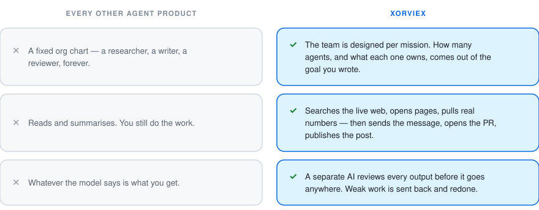
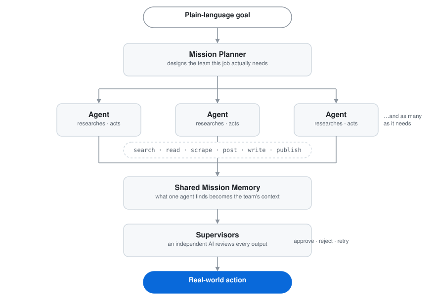
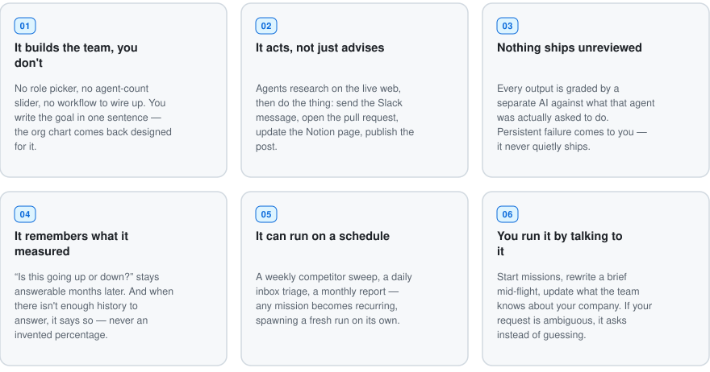
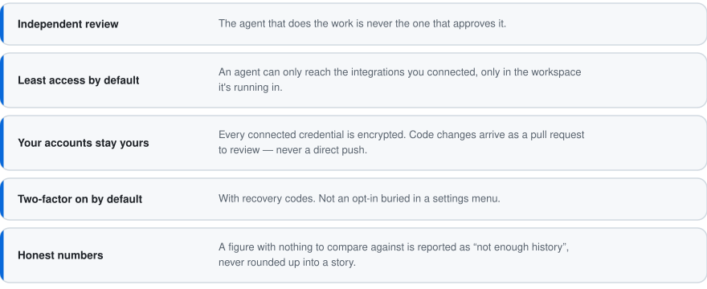
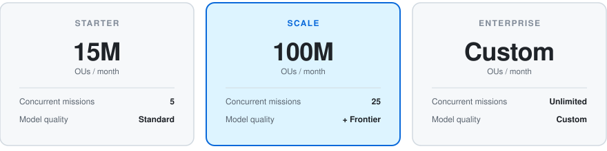

# Xorviex

### Set the goal. Xorviex spawns the workforce.

<b>A self-architecting AI executive.</b> 
You give it a mission in plain language. It designs the team that mission needs, 
sends them out to research and <i>act</i> with real tools, and lets nothing 
reach the real world until another AI has signed off on it.

&nbsp;&nbsp;&nbsp;&nbsp;&nbsp;&nbsp;

 

<h2 align="center">What it is</h2>

<i>"Find every distributor in the DACH region selling a competing product and tell me how our pricing compares."</i>

 

<picture>
  <source media="(prefers-color-scheme: dark)" srcset="assets/compare-dark.svg" />
  
</picture>

<h2 align="center">How it works</h2>

<picture>
  <source media="(prefers-color-scheme: dark)" srcset="assets/flow-dark.svg" />
  
</picture>

Watch it live · pause it · rewrite an agent's brief mid-run · or walk away and let it finish.

<h2 align="center">What it does for you</h2>

<picture>
  <source media="(prefers-color-scheme: dark)" srcset="assets/features-dark.svg" />
  
</picture>

<h2 align="center">Works with your stack</h2>

  

Connect what you use. Agents only ever get the tools your workspace actually connected — nothing else is on the table.

<h2 align="center">Built to be trusted with real access</h2>

<picture>
  <source media="(prefers-color-scheme: dark)" srcset="assets/trust-dark.svg" />
  
</picture>

<h2 align="center">Pricing</h2>

Work is measured in <b>Operation Units (OU)</b> — one unit is one thing an agent did: 
a page scraped, a message sent, a draft written, a review performed.

 

<picture>
  <source media="(prefers-color-scheme: dark)" srcset="assets/pricing-dark.svg" />
  
</picture>

For scale: a real mission — one goal, four to six agents, live research plus a review on every output — runs about <b>1.3M OUs</b> end to end.

### Status

Xorviex is a live commercial platform running at **[xorviex.ai](https://xorviex.ai)**. 
This repository is a public overview of what it is and what it does — the product itself is closed-source.

**Built by [Tunahan Faruk Savranoğlu](https://www.linkedin.com/in/tunahan-faruk-savrano%C4%9Flu-b71016370/)** 
founder, and the engineer behind every line of it

 

<a href="https://xorviex.ai">xorviex.ai</a> · <a href="https://www.linkedin.com/company/xorviex/">LinkedIn</a> · <a href="https://x.com/xorviex">X</a> · <a href="https://github.com/Xorviex-Labs">GitHub</a>

